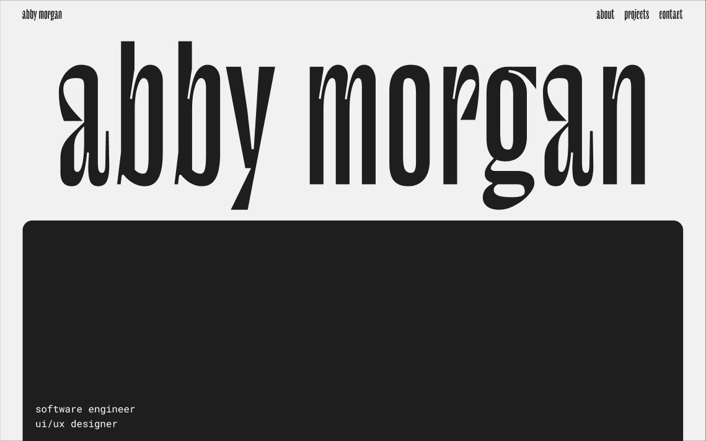

# Portfolio Website

This portfolio website was initially prototyped in Figma and later implemented using Webflow. Subsequently, it was recreated using Next.js to match the Figma prototype closely. The website employs GSAP for smooth animations on scrolling.

## Links

_webflow_

> https://practice-site-6f503d.webflow.io/

_nextjs_

> https://abbymorgan.vercel.app/

_figma_

> https://www.figma.com/file/GcUVy9ijmFVYOoPf9wThRn/abby-morgan-portfolio-update?type=design&node-id=0%3A1&mode=design&t=9XaAjp1fUKQKMCNG-1

## Features

- Responsive design for various devices.
- Integration of Figma prototypes.
- Smooth animations powered by GSAP.
- Placeholder for images to be linked with Figma prototypes.

## Technologies Used

- Figma
- Webflow
- Next.js
- GSAP

## Screenshots

## Usage

1. Clone the repository.
2. Install dependencies using `npm install`.
3. Run the development server using `npm run dev`.

## Acknowledgments

- Figma for prototyping.
- Webflow for website implementation.
- Next.js for recreating the website.
- GSAP for smooth animations.

## License

This project is licensed under the [MIT License](LICENSE).
