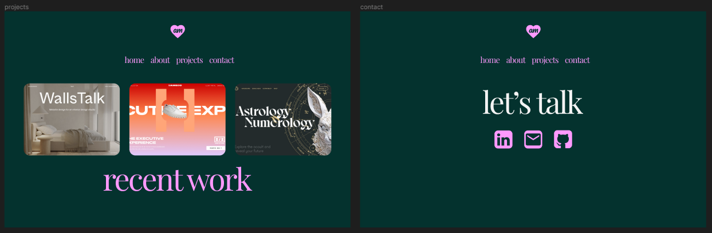

<h1 align='center'>
abby-morgan-portfolio
</h1>

`live site`

> https://abbymorgan.netlify.app/

### figma website layout

> https://www.figma.com/file/UnIahpYvSvp0o3gX5Ng99p/bb-portfolio-page?type=design&node-id=0%3A1&mode=design&t=3HFXZ2G47hTgek0z-1

## Figma Prototype

# Web

# Mobile

`todo`

> implement mobile nav menu
> issues with mobile nav menu:
>
> 1. styling
> 2. missing logo
